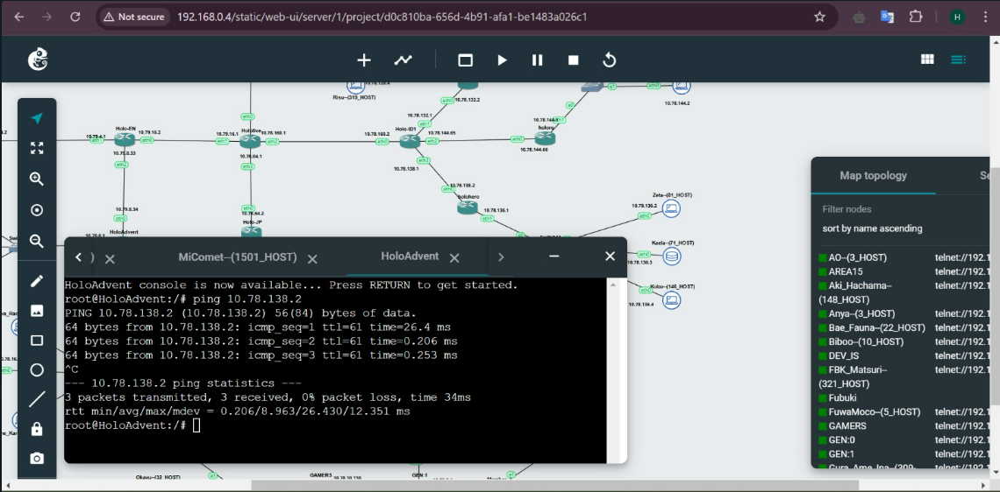
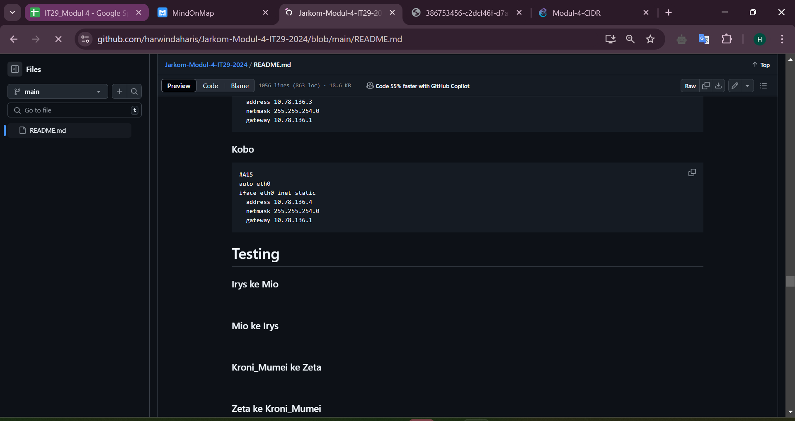

# Jarkom-Modul-4-IT29-2024

## Anggota Kelompok
| Nama | NRP |
|---------|---------|
| Harwinda | 5027231079   |
| Muhammad Syahmi Ash Shidqi | 5027231085 |

# GNS3 (CIDR)
## Topologi


### Subnetting


### Gabungan 2 (B)


### Gabungan 3 (C)


### Gabungan 4 (D)


### Gabungan 5 (E)


### Gabungan 6 (F)


### Gabungan 7 (G)


### Gabungan 8 (H)


<br>


### Gabungan 9 (I)


<br>


### Gabungan 10 (J)


<br>


## Tree


## Pembagian IP - CIDR
Prefix IP:**10.78**
| Subnet	| Network ID	| Netmask	| Broadcast	| Range IP |
|----|-----|-----|-----|-----|
|A1	|10.79.2.0	|255.255.255.192	|10.79.2.63	|10.79.2.1 - 10.79.2.62|
|A2	|10.79.2.128	|255.255.255.248	|10.79.2.135	|10.79.2.129 - 10.79.2.134|
|A3	|10.79.2.64	|255.255.255.248	|10.79.2.71	|10.79.2.65 - 10.79.2.70|
|A4	|10.79.0.0	|255.255.254.0	|10.79.1.255|	|10.79.0.1 - 10.79.1.254|
|A5	|10.79.4.0	|255.255.255.252	|10.79.4.3|	10.79.4.1 - 10.79.4.2|
|A6	|10.79.8.32	|255.255.255.252	|10.79.8.35|	10.79.8.33 - 10.79.8.34|
|A7	|10.79.8.0	|255.255.255.224	|10.79.8.31	|10.79.8.1 - 10.79.8.30|
|A8	|10.79.16.0	|255.255.255.252|	10.79.16.3	|10.79.16.1 - 10.79.16.2|
|A9	|10.78.160.0	|255.255.255.252|	10.78.160.3	|10.78.160.1 - 10.78.160.2|
|A10|	10.78.132.0	|255.255.255.252|	10.78.132.3	|10.78.132.1 - 10.78.132.2|
|A11|	10.78.128.0	|255.255.252.0	|10.78.131.255	|10.78.128.1 - 10.78.131.254|
|A12|	10.78.144.64	|255.255.255.252|	10.78.144.67	|10.78.144.65 - 10.78.144.66|
|A13|	10.78.144.0|	255.255.255.192|	10.78.144.63|	10.78.144.1 - 10.78.144.62|
|A14|	10.78.138.0	|255.255.255.252	|10.78.138.3	|10.78.138.1 - 10.78.138.2|
|A15|	10.78.136.0	|255.255.254.0	|10.78.137.255	|10.78.136.1 - 10.78.137.254|
|A16|	10.78.64.0|	255.255.255.252	|10.78.64.3|	10.78.64.1 - 10.78.64.2|
|A17|	10.78.32.0	|255.255.255.248	|10.78.32.7	|10.78.32.1 - 10.78.32.6|
|A18|	10.78.16.0	|255.255.255.240	|10.78.16.15	|10.78.16.1 - 10.78.16.14|
|A19|	10.78.0.0	|255.255.248.0	|10.78.7.255	|10.78.0.1 - 10.78.7.254|
|A20|	10.78.8.0	|255.255.254.0	|10.78.9.255	|10.78.8.1 - 10.78.9.254|
|A21|	10.78.10.128|	255.255.255.252	|10.78.10.131|	10.78.10.129 - 10.78.10.130|
|A22|	10.78.10.0	|255.255.255.128	|10.78.10.127|	10.78.10.1 - 10.78.10.126|

## Konfigurasi
### Hololive 
```
auto eth0
iface eth0 inet dhcp

#A8
auto eth1
iface eth1 inet static
    address 10.79.16.1
    netmask 255.255.255.252

#A9
auto eth2
iface eth2 inet static
    address 10.78.160.1
    netmask 255.255.255.252

#A16
auto eth3
iface eth3 inet static
    address 10.78.64.1
    netmask 255.255.255.252
```

### Holo-EN 
```
#A8
auto eth0
iface eth0 inet static
  address 10.79.16.2
  netmask 255.255.255.252
  gateway 10.79.16.1

#A5
auto eth1
iface eth1 inet static
  address 10.79.4.1
  netmask 255.255.255.252

#A6
auto eth2
iface eth2 inet static
  address 10.79.8.33
  netmask 255.255.255.252
```

### Holo-Myth 
```
auto eth0
iface eth0 inet static
  address 10.79.4.2
  netmask 255.255.255.252
  gateway 10.79.4.1

auto eth1
iface eth1 inet static
  address 10.79.2.129
  netmask 255.255.255.248

auto eth2
iface eth2 inet static
  address 10.79.0.1
  netmask 255.255.254.0
```

### Gura_Ame_Ina (Client)
```
auto eth0
iface eth0 inet static
  address 10.79.0.3
  netmask 255.255.254.0
  gateway 10.79.0.1
```

### Kiara_Caili (Client)
```
auto eth0
iface eth0 inet static
  address 10.79.0.2
  netmask 255.255.254.0
  gateway 10.79.0.1
```

### HoloAdvent
```
auto eth0
iface eth0 inet static
  address 10.79.8.34
  netmask 255.255.255.252
  gateway 10.79.8.33

auto eth1
iface eth1 inet static
  address 10.79.8.1
  netmask 255.255.255.224
```

### FuwaMoco (Client)
```
auto eth0
iface eth0 inet static
  address 10.79.8.2
  netmask 255.255.255.224
  gateway 10.79.8.1
```

### Shiori_Nerissa (Client)
```
auto eth0
iface eth0 inet static
  address 10.79.8.3
  netmask 255.255.255.224
  gateway 10.79.8.1
```

### Biboo (Client)
```
auto eth0
iface eth0 inet static
  address 10.79.8.4
  netmask 255.255.255.224
  gateway 10.79.8.1
```

### Project-Hope
```
auto eth0
iface eth0 inet static
  address 10.79.2.130
  netmask 255.255.255.248
  gateway 10.79.2.129

auto eth1
iface eth1 inet static
  address 10.79.2.65
  netmask 255.255.255.248
```

### Irys (Client)
```
auto eth0
iface eth0 inet static
  address 10.79.2.66
  netmask 255.255.255.248
  gateway 10.79.2.65
```

### Holo-Council
```
auto eth0
iface eth0 inet static
  address 10.79.2.131
  netmask 255.255.255.248
  gateway 10.79.2.129

auto eth1
iface eth1 inet static
  address 10.79.2.1
  netmask 255.255.255.192
```

### Kronii_Mumei (Client)
```
auto eth0
iface eth0 inet static
  address 10.79.2.2
  netmask 255.255.255.192
  gateway 10.79.2.1
```

### Bae_Fauna (Client)
```
auto eth0
iface eth0 inet static
  address 10.79.2.3
  netmask 255.255.255.192
  gateway 10.79.2.1
```

### Holo-JP
```
auto eth0
iface eth0 inet static
  address 10.78.64.2
  netmask 255.255.255.252
  gateway 10.78.64.1

auto eth1
iface eth1 inet static
  address 10.78.32.1
  netmask 255.255.255.248
```

### DEV_IS
```
auto eth0
iface eth0 inet static
  address 10.78.32.2
  netmask 255.255.255.248
  gateway 10.78.32.1

auto eth1
iface eth1 inet static
  address 10.78.16.1
  netmask 255.255.255.240
```

### Ririka_Raden (Client)
```
auto eth0
iface eth0 inet static
  address 10.78.16.2
  netmask 255.255.255.240
  gateway 10.78.16.1
```

### Ao (Client)
```
auto eth0
iface eth0 inet static
  address 10.78.16.3
  netmask 255.255.255.240
  gateway 10.78.16.1
```

### Hajime_Kanade (Client)
```
auto eth0
iface eth0 inet static
  address 10.78.16.4
  netmask 255.255.255.240
  gateway 10.78.16.1
```

### GEN:0
```
auto eth0
iface eth0 inet static
  address 10.78.32.3
  netmask 255.255.255.248
  gateway 10.78.32.1

auto eth1
iface eth1 inet static
  address 10.78.0.1
  netmask 255.255.248.0
```

### MiComet (Client)
```
auto eth0
iface eth0 inet static
  address 10.78.0.2
  netmask 255.255.248.0
  gateway 10.78.0.1
```

### Sora_Robo_AZKi (Client)
```
auto eth0
iface eth0 inet static
  address 10.78.0.3
  netmask 255.255.248.0
  gateway 10.78.0.1
```

### GEN:1
```
auto eth0
iface eth0 inet static
  address 10.78.0.4
  netmask 255.255.248.0
  gateway 10.78.0.1

auto eth1
iface eth1 inet static
  address 10.78.10.129
  netmask 255.255.255.252

#A20
auto eth2
iface eth2 inet static
  address 10.78.8.1
  netmask 255.255.254.0
```

### FBK_Matsuri
```
auto eth0
iface eth0 inet static
  address 10.78.8.2
  netmask 255.255.254.0
  gateway 10.78.8.1
```

### Aki_Hachama
```
auto eth0
iface eth0 inet static
  address 10.78.8.3
  netmask 255.255.254.0
  gateway 10.78.8.1
```

### GAMERS
```
auto eth0
iface eth0 inet static
  address 10.78.10.130
  netmask 255.255.255.252
  gateway 10.78.10.129

auto eth1
iface eth1 inet static
  address 10.78.10.1
  netmask 255.255.255.128
```

### Korone
```
auto eth0
iface eth0 inet static
  address 10.78.10.2
  netmask 255.255.255.128
  gateway 10.78.10.1
```

### Okayu
```
auto eth0
iface eth0 inet static
  address 10.78.10.3
  netmask 255.255.255.128
  gateway 10.78.10.1
```

### Mio
```
auto eth0
iface eth0 inet static
  address 10.78.10.4
  netmask 255.255.255.128
  gateway 10.78.10.1
```

### Holo-ID
```
#A9
auto eth0
iface eth0 inet static
  address 10.78.160.2
  netmask 255.255.255.252
  gateway 10.78.160.1

#A10
auto eth1
iface eth1 inet static
  address 10.78.132.1
  netmask 255.255.255.252

#A12
auto eth2
iface eth2 inet static
  address 10.78.144.65
  netmask 255.255.255.252

#A14
auto eth3
iface eth3 inet static
  address 10.78.138.1
  netmask 255.255.255.252
```

### AREA15
```
#A10
auto eth0
iface eth0 inet static
  address 10.78.132.2
  netmask 255.255.255.252
  gateway 10.78.132.1

#A11
auto eth1
iface eth1 inet static
  address 10.78.128.1
  netmask 255.255.252.0
```

### Risu
```
auto eth0
iface eth0 inet static
  address 10.78.128.4
  netmask 255.255.252.0
  gateway 10.78.128.1
```

### Moona
```
auto eth0
iface eth0 inet static
  address 10.78.128.3
  netmask 255.255.252.0
  gateway 10.78.128.1
```

### Lofi
```
auto eth0
iface eth0 inet static
  address 10.78.128.2
  netmask 255.255.252.0
  gateway 10.78.128.1
```

### Holoro
```
#A12
auto eth0
iface eth0 inet static
  address 10.78.144.66
  netmask 255.255.255.252
  gateway 10.78.144.65

#A13
auto eth1
iface eth1 inet static
  address 10.78.144.1 
  netmask 255.255.255.192
```

### Ollie
```
auto eth0
iface eth0 inet static
  address 10.78.144.4
  netmask 255.255.255.192
  gateway 10.78.144.1
```

### Anya
```
auto eth0
iface eth0 inet static
  address 10.78.144.3
  netmask 255.255.255.192
  gateway 10.78.144.1
```

### Reine
```
auto eth0
iface eth0 inet static
  address 10.78.144.2
  netmask 255.255.255.192
  gateway 10.78.144.1
```

### Holoh3ro
```
#A14
auto eth0
iface eth0 inet static
  address 10.78.138.2
  netmask 255.255.255.252
  gateway 10.78.138.1

#A15
auto eth1
iface eth1 inet static
  address 10.78.136.1
  netmask 255.255.254.0
```

### Zeta
```
#A15
auto eth0
iface eth0 inet static
  address 10.78.136.2
  netmask 255.255.254.0
  gateway 10.78.136.1
```

### Kaela
```
#A15
auto eth0
iface eth0 inet static
  address 10.78.136.3
  netmask 255.255.254.0
  gateway 10.78.136.1
```

### Kobo
```
#A15
auto eth0
iface eth0 inet static
  address 10.78.136.4
  netmask 255.255.254.0
  gateway 10.78.136.1
```

## Routing
### Hololive
```
#KIRI
post-up route add -net 10.79.16.0 netmask 255.255.255.252 gw 10.79.16.2 #A8
post-up route add -net 10.79.0.0 netmask 255.255.254.0 gw 10.79.16.2 #A4
post-up route add -net 10.79.4.0 netmask 255.255.255.252 gw 10.79.16.2 #A5
post-up route add -net 10.79.2.64 netmask 255.255.255.248 gw 10.79.16.2 #A3
post-up route add -net 10.79.2.0 netmask 255.255.255.192 gw 10.79.16.2 #A1
post-up route add -net 10.79.8.0 netmask 255.255.255.224 gw 10.79.16.2 #A7
post-up route add -net 10.79.8.32 netmask 255.255.255.252 gw 10.79.16.2 #A6
post-up route add -net 10.79.2.128 netmask 255.255.255.248 gw 10.79.16.2 #A2

#BAWAH
post-up route add -net 10.78.16.0 netmask 255.255.255.240 gw 10.78.64.2 #A18
post-up route add -net 10.78.32.0 netmask 255.255.255.248 gw 10.78.64.2 #A17
post-up route add -net 10.78.0.0 netmask 255.255.248.0 gw 10.78.64.2 #A19
post-up route add -net 10.78.8.0 netmask 255.255.254.0 gw 10.78.64.2 #A20
post-up route add -net 10.78.10.128 netmask 255.255.255.252 gw 10.78.64.2 #A21
post-up route add -net 10.78.10.0 netmask 255.255.255.128 gw 10.78.64.2 #A22

#KANAN
post-up route add -net 10.78.132.0 netmask 255.255.255.252 gw 10.78.160.2 #A10
post-up route add -net 10.78.128.0 netmask 255.255.252.0 gw 10.78.160.2 #A11
post-up route add -net 10.78.144.64 netmask 255.255.255.252 gw 10.78.160.2 #A12
post-up route add -net 10.78.144.0 netmask 255.255.255.192 gw 10.78.160.2 #A13
post-up route add -net 10.78.138.0 netmask 255.255.255.252 gw 10.78.160.2 #A14
post-up route add -net 10.78.136.0 netmask 255.255.254.0 gw 10.78.160.2 #A15
```

### Holo-EN
```
post-up route add -net 10.79.0.0 netmask 255.255.254.0 gw 10.79.4.2 #A4
post-up route add -net 10.79.2.64 netmask 255.255.255.248 gw 10.79.4.2 #A3
post-up route add -net 10.79.2.128 netmask 255.255.255.248 gw 10.79.4.2 #A2
post-up route add -net 10.79.2.0 netmask 255.255.255.192 gw 10.79.4.2 #A1
post-up route add -net 10.79.8.0 netmask 255.255.255.224 gw 10.79.8.34 #A7
post-up route add -net 10.78.160.0 netmask 255.255.255.252 gw 10.79.16.1
```

### Holo-Myth
```
post-up route add -net 10.79.2.64 netmask 255.255.255.248 gw 10.79.2.130 #A3
post-up route add -net 10.79.16.0 netmask 255.255.255.252 gw 10.79.4.1 #A8
post-up route add -net 10.79.2.0 netmask 255.255.255.192 gw 10.79.2.131 #A1
post-up route add -net 10.78.8.0 netmask 255.255.254.0 gw 10.79.4.1 #A7
```

### Holo-Council 
```
post-up route add -net 10.79.0.0 netmask 255.255.254.0 gw 10.79.2.129 #A4
post-up route add -net 10.79.16.0 netmask 255.255.255.252 gw 10.79.2.129 #A8
post-up route add -net 10.79.4.0 netmask 255.255.255.252 gw 10.79.2.129 #A5
```

### Project-Hope
```
post-up route add -net 10.79.0.0 netmask 255.255.254.0 gw 10.79.2.129 #A4
post-up route add -net 10.79.16.0 netmask 255.255.255.252 gw 10.79.2.129 #A8
post-up route add -net 10.79.4.0 netmask 255.255.255.252 gw 10.79.2.129 #A5
post-up route add -net 10.79.2.0 netmask 255.255.255.192 gw 10.79.2.131 #A1
post-up route add -net 10.78.136.0 netmask 255.255.254.0 gw 10.79.2.129 #A15
```

### HoloAdvent
```
post-up route add -net 10.79.16.0 netmask 255.255.255.252 gw 10.79.8.33 #A8
```

### Holo-JP
```
#KIRI
post-up route add -net 10.78.16.0 netmask 255.255.255.240 gw 10.78.32.2 #A18

#KANAN
post-up route add -net 10.78.0.0 netmask 255.255.248.0 gw 10.78.32.3 #A19

#BAWAH
post-up route add -net 10.78.8.0 netmask 255.255.254.0 gw 10.78.32.3 #A20
post-up route add -net 10.78.10.0 netmask 255.255.255.128 gw 10.78.32.3 #A22
post-up route add -net 10.78.10.128 netmask 255.255.255.252 gw 10.78.32.3 #A21
```
### DEV_IS
```
post-up route add -net 10.78.64.0 netmask 255.255.255.252 gw 10.78.32.1 #A16
```

### GEN:0
```
post-up route add -net 10.78.64.0 netmask 255.255.255.252 gw 10.78.32.1 #A16
post-up route add -net 10.78.8.0 netmask 255.255.254.0 gw 10.78.0.4 #A20
post-up route add -net 10.78.10.0 netmask 255.255.255.128 gw 10.78.0.4 #A22
post-up route add -net 10.78.10.128 netmask 255.255.255.252 gw 10.78.0.4 #A21
```

### GEN:1
```
post-up route add -net 10.78.10.0 netmask 255.255.255.128 gw 10.78.10.130 #A22
post-up route add -net 10.78.32.0 netmask 255.255.255.248 gw 10.78.0.1 #A17
post-up route add -net 10.78.64.0 netmask 255.255.255.252 gw 10.78.0.1 #A16

post-up route add -net 10.78.64.0 netmask 255.255.255.252 gw 10.78.0.1 #A16
post-up route add -net 10.78.10.0 netmask 255.255.255.128 gw 10.78.10.130 #A22
```

### GAMERS
```
post-up route add -net 10.78.64.0 netmask 255.255.255.252 gw 10.78.10.129 #A16
post-up route add -net 10.78.0.0 netmask 255.255.248.0 gw 10.78.10.129 #A19
post-up route add -net 10.78.32.0 netmask 255.255.255.248 gw 10.78.10.129 #A17
```

### Holo-ID
```
post-up route add -net 10.78.128.0 netmask 255.255.252.0 gw 10.78.132.2 #A11
post-up route add -net 10.78.144.0 netmask 255.255.255.192 gw 10.78.144.66 #A13
post-up route add -net 10.78.136.0 netmask 255.255.254.0 gw 10.78.138.2 #A15
post-up route add -net 10.79.16.0 netmask 255.255.255.252 gw 10.78.160.1 #A8
```

### AREA15
```
post-up route add -net 10.78.160.0 netmask 255.255.255.252 gw 10.78.132.1 #A9
```

### Holoro
```
post-up route add -net 10.78.160.0 netmask 255.255.255.252 gw 10.78.144.65 #A9
```

### Holoh3ro
```
post-up route add -net 10.78.160.0 netmask 255.255.255.252 gw 10.78.138.1 #A9
post-up route add -net 10.79.2.0 netmask 255.255.255.192 gw 10.78.138.1
post-up route add -net 10.79.8.32 netmask 255.255.255.252 gw 10.78.138.1
post-up route add -net 10.79.16.0 netmask 255.255.255.252 gw 10.78.138.1
post-up route add -net 10.79.8.0 netmask 255.255.255.224 gw 10.78.138.1
```

## Testing
### Irys ke Mio


### Mio ke Irys


### Kroni_Mumei ke Zeta


### Zeta ke Kroni_Mumei 


### Fuwamoco ke Gamers


### MiComet ke Holoro


### HoloAdvent ke Holoh3ro



### HoloID Ke DevIS



# CPT (VSLM)

### Topologi


### Tree


### Pembagian IP - VLSM

| Subnet	| Network ID	| Netmask	| Broadcast	| Range IP |
|----|-----|-----|-----|-----|
|A1	|10.78.18.128	|255.255.255.192	|10.78.18.191	|10.78.18.129 - 10.78.18.190|
|A2	|10.78.19.48	|255.255.255.248	|10.78.19.55	|10.78.19.49 - 10.78.19.54|
|A3	|10.78.19.56	|255.255.255.248	|10.78.19.63	|10.78.19.57 - 10.78.19.62|
|A4	|10.78.12.0	|255.255.254.0	|10.74.13.255|	|10.78.12.1 - 10.78.13.254|
|A5	|10.78.19.72	|255.255.255.252	|10.78.19.75|	10.78.19.73 - 10.78.19.74|
|A6	|10.78.19.76	|255.255.255.252	|10.78.19.79|	10.78.19.77 - 10.78.19.78|
|A7	|10.78.19.0	|255.255.255.224	|10.78.19.31	|10.78.19.1 - 10.78.19.30|
|A8	|10.78.19.80	|255.255.255.252|	10.78.19.83	|10.78.19.81 - 10.78.19.82|
|A9	|10.78.19.84	|255.255.255.252|	10.78.19.87	|10.78.19.85 - 10.78.19.86|
|A10|	10.78.19.88	|255.255.255.252|	10.78.19.91	|10.78.19.89 - 10.78.19.90|
|A11|	10.78.8.0	|255.255.252.0	|10.78.11.255	|10.78.8.1 - 10.78.11.254|
|A12|	10.78.19.92	|255.255.255.252|	10.78.19.95	|10.78.19.93 - 10.78.19.94|
|A13|	10.78.18.192|	255.255.255.192|	10.78.18.255|	10.78.18.193 - 10.78.18.254|
|A14|	10.78.19.96	|255.255.255.252	|10.78.19.99	|10.78.19.97 - 10.78.19.98|
|A15|	10.78.14.0	|255.255.254.0	|10.78.15.255	|10.78.14.1 - 10.78.15.245|
|A16|	10.78.19.100|	255.255.255.252	|10.78.19.103|	10.78.19.101 - 10.78.19.102|
|A17|	10.78.19.64	|255.255.255.248	|10.78.19.71	|10.78.19.65 - 10.78.19.70|
|A18|	10.78.19.32	|255.255.255.240	|10.78.19.47	|10.78.19.33 - 10.78.19.46|
|A19|	10.78.0.0	|255.255.248.0	|10.78.7.255	|10.78.0.1 - 10.78.7.245|
|A20|	10.78.16.0	|255.255.254.0	|10.78.17.255	|10.78.16.1 - 10.78.17.254|
|A21|	10.78.19.104|	255.255.255.252	|10.78.19.107|	10.78.19.105 - 10.78.19.106|
|A22|	10.78.18.0	|255.255.255.128	|10.78.18.127|	10.78.18.1 - 10.78.18.126|

### Konfigurasi

- Hololive
```
Fa0/1:10.78.19.101 (A16)
Netmask: 255.255.255.252

Fa1/0: 10.78.19.81 (A8)
Netmask: 255.255.255.252

Fa1/1: 10.78.19.85 (A9)
Netmask: 255.255.255.252
```

- Holo-EN
```
Fa0/0: 10.78.19.82 (A8)
Netmask: 255.255.255.252

Fa0/1: 10.78.19.73 (A5)
Netmask: 255.255.255.252

Fa1/0: 10.78.19.77 (A6)
Netmask: 255.255.255.252
```

- Holo-ID
```
Fa0/0: 10.78.19.86 (A9)
Netmask: 255.255.255.252

Fa0/1: 10.78.19.93 (A12)
Netmask: 255.255.255.252

Fa1/0: 10.78.19.89 (A10)
Netmask: 255.255.255.252

Fa1/1: 10.78.19.97 (A14)
Netmask: 255.255.255.252
```

- Holo-Myth
```
Fa0/0: 10.78.19.74 (A5)
Netmask: 255.255.255.252

Fa0/1: 10.78.19.49 (A2)
Netmask: 255.255.255.248

Fa1/0: 10.78.12.1 (A4)
Netmask: 255.255.254.0
```

- HoloAdvent
```
Fa0/0: 10.78.19.78 (A6)
Netmask: 255.255.255.252

Fa0/1: 10.78.19.1 (A7)
Netmask: 255.255.255.224
```

- Router4
```
Fa0/0: 10.78.19.50 (A2)
Netmask: 255.255.255.248

Fa0/1: 10.78.19.57 (A3)
Netmask: 255.255.255.248
```

- Holo-Council
```
Fa0/0: 10.78.19.51 (A2)
Netmask: 255.255.255.248

Fa0/1: 10.78.18.129 (A1)
Netmask: 255.255.255.192
```

- AREA15
```
Fa0/0: 10.78.19.90 (A10)
Netmask: 255.255.255.252

Fa0/1: 10.78.8.1 (A11)
Netmask: 255.255.252.0
```

- holoro
```
Fa0/0: 10.78.19.94 (A12)
Netmask: 255.255.255.252

Fa0/1: 10.78.18.193 (A13)
Netmask: 255.255.255.192
```

- holoh3ro
```
Fa0/0: 10.78.19.97 (A14)
Netmask: 255.255.255.252

Fa0/1: 10.78.14.1 (A15)
Netmask: 255.255.254.0
```

- Holo-JP
```
Fa0/0: 10.78.19.102 (A16)
Netmask: 255.255.255.252

Fa0/1: 10.78.19.65 (A17)
Netmask: 255.255.255.248
```

- DEV_IS
```
Fa0/0: 10.78.19.66 (A17)
Netmask: 255.255.255.248

Fa0/1: 10.78.19.33 (A18)
Netmask: 255.255.255.240
```

- GEN:0
```
Fa0/0: 10.78.19.67 (A17)
Netmask: 255.255.255.248

Fa0/1: 10.78.0.1 (A19)
Netmask: 255.255.248.0
```

- GEN:1
```
Fa0/0: 10.78.7.242 (A19)
Netmask: 255.255.248.0

Fa0/1: 10.78.16.1 (A20)
Netmask: 255.255.254.0

Fa1/0: 10.78.19.105 (A21)
Netmask: 255.255.255.252
```

- GAMERS
```
Fa0/0: 10.78.19.106 (A21)
Netmask: 255.255.255.252

Fa0/1: 10.78.18.1 (A22)
Netmask: 255.255.255.128
```

- Kronii_Mumei
```
(A1) 
IPv4: 10.78.18.130
Netmask: 255.255.255.192
Gateway: 10.78.18.129
```

- Bae_Fauna
```
(A1) 
IPv4: 10.78.18.131
Netmask: 255.255.255.192
Gateway: 10.78.18.129
```

- Irys
```
(A3) 
IPv4: 10.78.19.58
Netmask: 255.255.255.248
Gateway: 10.78.19.57
```

- Gura_Ame_Ina
```
(A4) 
IPv4: 10.78.12.2
Netmask: 255.255.254.0
Gateway: 10.78.12.1
```

- Kiara_calli
```
(A4) 
IPv4: 10.78.13.56
Netmask: 255.255.254.0
Gateway: 10.78.12.1
```

- FuwaMoco
```
(A7) 
IPv4: 10.78.19.2
Netmask: 255.255.255.224
Gateway: 10.78.19.1
```

- Shiori_Nerissa
```
(A7) 
IPv4: 10.78.19.7
Netmask: 255.255.255.224
Gateway: 10.78.19.1
```

- Biboo
```
(A7) 
IPv4: 10.78.19.19
Netmask: 255.255.255.224
Gateway: 10.78.19.1
```

- Moona
```
(A11) 
IPv4: 10.78.8.142
Netmask: 255.255.252.0
Gateway: 10.78.8.1
```

- Risu
```
(A11) 
IPv4: 10.78.9.88
Netmask: 255.255.252.0
Gateway: 10.78.8.1
```

- lofi
```
(A11) 
IPv4: 10.78.8.2
Netmask: 255.255.252.0
Gateway: 10.78.8.1
```

- Ollie
```
(A13) 
IPv4: 10.78.18.194
Netmask: 255.255.255.192
Gateway: 10.78.18.193
```

- Anya
```
(A13) 
IPv4: 10.78.18.214
Netmask: 255.255.255.192
Gateway: 10.78.18.193
```

- Reine
```
(A13) 
IPv4: 10.78.18.217
Netmask: 255.255.255.192
Gateway: 10.78.18.193
```

- Zeta
```
(A15) 
IPv4: 10.78.14.2
Netmask: 255.255.254.0
Gateway: 10.78.14.1
```

- Kaela
```
(A15) 
IPv4: 10.78.14.83
Netmask: 255.255.254.0
Gateway: 10.78.14.1
```

- Kobo
```
(A15) 
IPv4: 10.78.14.154
Netmask: 255.255.254.0
Gateway: 10.78.14.1
```

- Ririka_Raden
```
(A18) 
IPv4: 10.78.19.34
Netmask: 255.255.255.240
Gateway: 10.78.19.33
```

- Ao
```
(A18) 
IPv4: 10.78.19.37
Netmask: 255.255.255.240
Gateway: 10.78.19.33
```

- Hajime_Kanade
```
(A18) 
IPv4: 10.78.19.40
Netmask: 255.255.255.240
Gateway: 10.78.19.33
```

- MiComent
```
(A19) 
IPv4: 10.78.0.2
Netmask: 255.255.248.0
Gateway: 10.78.0.1
```

- Sora_Robo_AZKi
```
(A19) 
IPv4: 10.78.5.228
Netmask: 255.255.248.0
Gateway: 10.78.0.1
```

- FBK_Matsuri
```
(A20) 
IPv4: 10.78.16.2
Netmask: 255.255.254.0
Gateway: 10.78.16.1
```

- Aki_Hachama
```
(A20) 
IPv4: 10.78.17.68
Netmask: 255.255.254.0
Gateway: 10.78.16.1
```

- Korone
```
(A22) 
IPv4: 10.78.18.2
Netmask: 255.255.255.128
Gateway: 10.78.18.1
```

- Okayu
```
(A22) 
IPv4: 10.78.18.53
Netmask: 255.255.255.128
Gateway: 10.78.18.1
```

- Mio
```
(A22) 
IPv4: 10.78.18.85
Netmask: 255.255.255.128
Gateway: 10.78.18.1
```

### Routing sisi kiri

- Hololive


- Holo-EN


- HoloAdvent


- Holo-Myth


- Router4


- Holo-Council


### Routing sisi kanan

- Hololive
- Holo-ID
- AREA15
- holoro
- holoh3ro

### Routing sisi bawah

- Holo-JP
- Dev_IS
- GEN:0
- GEN:1
- GAMERS

## Revisi

### Testing


